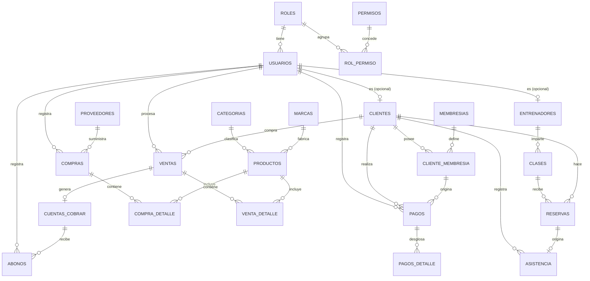

# APEX GYM — Diccionario de Datos y Diseño de Base de Datos

Documento de entrega para el proyecto de UTESA: sistema de gestión de gimnasio.
Base de datos: `apex_gym` · Motor: MySQL 8.0 · Charset: `utf8mb4` · Motor de tablas: InnoDB.

## 1. Diagrama Entidad-Relación (DER)

> Diagrama simplificado (sin todos los atributos) para visualizar cardinalidades. El detalle completo de cada tabla está en la sección 3.

## 2. Módulos del sistema

| Módulo | Tablas |
|---|---|
| Seguridad | `roles`, `permisos`, `rol_permiso`, `usuarios` |
| Clientes | `clientes` |
| Membresías | `membresias`, `cliente_membresia` |
| Pagos | `pagos`, `pagos_detalle` |
| Entrenadores / Clases | `entrenadores`, `clases`, `reservas`, `asistencia` |
| Inventario | `categorias`, `marcas`, `productos` |
| Compras | `proveedores`, `compras`, `compra_detalle` |
| POS (Ventas) | `ventas`, `venta_detalle` |
| Finanzas | `cuentas_cobrar`, `abonos` |
| Sistema | `configuracion` |

## 3. Diccionario de Datos

### 3.1 `roles`
| Campo | Tipo | Restricciones | Descripción |
|---|---|---|---|
| id_rol | INT UNSIGNED | PK, AUTO_INCREMENT | Identificador del rol |
| nombre_rol | VARCHAR(50) | NOT NULL, UNIQUE | Administrador, Recepcionista, Entrenador, Cliente |
| descripcion | VARCHAR(255) | NULL | Detalle del rol |
| estado | ENUM | NOT NULL, DEFAULT 'Activo' | Activo / Inactivo |
| creado_en | TIMESTAMP | NOT NULL | Fecha de creación |

### 3.2 `permisos`
| Campo | Tipo | Restricciones | Descripción |
|---|---|---|---|
| id_permiso | INT UNSIGNED | PK, AUTO_INCREMENT | Identificador del permiso |
| nombre_permiso | VARCHAR(80) | NOT NULL, UNIQUE | Clave del permiso, ej. `clientes.gestionar` |
| modulo | VARCHAR(50) | NOT NULL | Módulo al que pertenece |
| descripcion | VARCHAR(255) | NULL | Detalle del permiso |

### 3.3 `rol_permiso`
Tabla puente N:M entre `roles` y `permisos`.
| Campo | Tipo | Restricciones | Descripción |
|---|---|---|---|
| id_rol | INT UNSIGNED | PK compuesta, FK → roles | Rol |
| id_permiso | INT UNSIGNED | PK compuesta, FK → permisos | Permiso concedido a ese rol |

### 3.4 `usuarios`
| Campo | Tipo | Restricciones | Descripción |
|---|---|---|---|
| id_usuario | INT UNSIGNED | PK, AUTO_INCREMENT | Identificador de la cuenta |
| nombre / apellido | VARCHAR(80) | NOT NULL | Nombre de la persona |
| correo | VARCHAR(120) | NOT NULL, UNIQUE | Usado para iniciar sesión |
| contrasena_hash | VARCHAR(255) | NOT NULL | Hash bcrypt (nunca texto plano) |
| id_rol | INT UNSIGNED | NOT NULL, FK → roles | Rol asignado |
| estado | ENUM | DEFAULT 'Activo' | Activo / Inactivo / Suspendido |
| token_recuperacion | VARCHAR(255) | NULL | Token temporal de recuperación de contraseña |
| token_expira | DATETIME | NULL | Expiración del token (30 min) |
| ultimo_acceso | DATETIME | NULL | Última vez que inició sesión |
| fecha_creacion | TIMESTAMP | NOT NULL | Fecha de alta |

### 3.5 `clientes`
| Campo | Tipo | Restricciones | Descripción |
|---|---|---|---|
| id_cliente | INT UNSIGNED | PK, AUTO_INCREMENT | Identificador del cliente |
| id_usuario | INT UNSIGNED | NULL, UNIQUE, FK → usuarios | Cuenta de portal web (opcional) |
| nombre / apellido | VARCHAR(80) | NOT NULL | Nombre del cliente |
| cedula | VARCHAR(20) | NOT NULL, UNIQUE | Documento de identidad |
| telefono | VARCHAR(20) | NULL | Teléfono de contacto |
| correo | VARCHAR(120) | NULL | Correo de contacto |
| direccion | VARCHAR(255) | NULL | Dirección física |
| fecha_nacimiento | DATE | NULL | Fecha de nacimiento |
| sexo | ENUM('M','F','Otro') | NULL | Sexo |
| foto | VARCHAR(255) | NULL | Ruta/URL de la fotografía |
| fecha_registro | TIMESTAMP | NOT NULL | Fecha de inscripción |
| estado | ENUM | DEFAULT 'Activo' | Activo / Inactivo |

### 3.6 `membresias`
| Campo | Tipo | Restricciones | Descripción |
|---|---|---|---|
| id_membresia | INT UNSIGNED | PK | Identificador del plan |
| nombre | VARCHAR(60) | NOT NULL | Básico, Premium, VIP Elite |
| descripcion | VARCHAR(255) | NULL | Detalle del plan |
| precio | DECIMAL(10,2) | NOT NULL, CHECK ≥ 0 | Precio del plan |
| duracion_dias | SMALLINT UNSIGNED | NOT NULL | Duración en días |
| estado | ENUM | DEFAULT 'Activo' | Activo / Inactivo |

### 3.7 `cliente_membresia`
| Campo | Tipo | Restricciones | Descripción |
|---|---|---|---|
| id_cliente_membresia | INT UNSIGNED | PK | Identificador de la asignación |
| id_cliente | INT UNSIGNED | NOT NULL, FK → clientes | Cliente |
| id_membresia | INT UNSIGNED | NOT NULL, FK → membresias | Plan asignado |
| fecha_inicio / fecha_fin | DATE | NOT NULL, CHECK fin ≥ inicio | Vigencia |
| estado | ENUM | DEFAULT 'Activa' | Activa / Vencida / Cancelada |
| fecha_renovacion | TIMESTAMP | NULL | Última renovación |

### 3.8 `pagos` / `pagos_detalle`
`pagos`: id_pago, id_cliente (FK), id_cliente_membresia (FK nullable), id_usuario (FK, quien cobra), fecha_pago, metodo_pago (ENUM), monto_total (CHECK ≥0), numero_recibo (UNIQUE), estado.
`pagos_detalle`: id_detalle_pago, id_pago (FK, ON DELETE CASCADE), concepto, cantidad, monto — permite desglosar un pago en varios conceptos.

### 3.9 `entrenadores`, `clases`, `reservas`, `asistencia`
- **entrenadores**: id_entrenador, id_usuario (FK nullable/unique), nombre, apellido, cedula (UNIQUE), telefono, correo, especialidad, fecha_contratacion, estado.
- **clases**: id_clase, nombre, id_entrenador (FK), capacidad_maxima, dia_semana (ENUM), hora_inicio/hora_fin (CHECK fin > inicio), estado.
- **reservas**: id_reserva, id_clase (FK), id_cliente (FK), fecha_reserva, fecha_clase, estado (ENUM), UNIQUE(id_clase, id_cliente, fecha_clase) para evitar reservas duplicadas.
- **asistencia**: id_asistencia, id_cliente (FK), id_reserva (FK nullable), fecha, hora_entrada, hora_salida — check-in general del gimnasio, ligado opcionalmente a una clase reservada.

### 3.10 `categorias`, `marcas`, `productos`
- **categorias**: id_categoria, nombre (UNIQUE), descripcion, estado.
- **marcas**: id_marca, nombre (UNIQUE), estado.
- **productos**: id_producto, codigo (UNIQUE), codigo_barras (UNIQUE), nombre, descripcion, id_categoria (FK), id_marca (FK), precio_compra, precio_venta, stock (CHECK ≥0), stock_minimo, imagen, estado.

### 3.11 `proveedores`, `compras`, `compra_detalle`
- **proveedores**: id_proveedor, nombre, contacto, telefono, correo, direccion, estado.
- **compras**: id_compra, id_proveedor (FK), id_usuario (FK), fecha, subtotal, impuesto, total, estado.
- **compra_detalle**: id_detalle_compra, id_compra (FK, CASCADE), id_producto (FK), cantidad (CHECK >0), precio_compra, subtotal.

### 3.12 `ventas`, `venta_detalle` (POS)
- **ventas**: id_venta, fecha, id_cliente (FK nullable — consumidor final), id_usuario (FK, cajero), tipo_pago ENUM('Contado','Credito'), subtotal, descuento, impuesto, total, estado.
- **venta_detalle**: id_detalle, id_venta (FK, CASCADE), id_producto (FK), cantidad (CHECK >0), precio, descuento, subtotal.

### 3.13 `cuentas_cobrar`, `abonos`
- **cuentas_cobrar**: id_cuenta, id_venta (FK, UNIQUE — una cuenta por venta a crédito), id_cliente (FK), saldo (CHECK ≥0), fecha_vencimiento, estado ENUM('Pendiente','Pagada','Vencida').
- **abonos**: id_abono, id_cuenta (FK), id_usuario (FK), fecha, monto (CHECK >0).

### 3.14 `configuracion`
Tabla clave-valor para parámetros generales del sistema (nombre del gimnasio, moneda, % de impuesto, horario, días de gracia).
| Campo | Tipo | Restricciones |
|---|---|---|
| id_configuracion | INT UNSIGNED | PK |
| clave | VARCHAR(60) | NOT NULL, UNIQUE |
| valor | VARCHAR(255) | NOT NULL |
| descripcion | VARCHAR(255) | NULL |

## 4. Justificación de decisiones de diseño

- **Separación `usuarios` vs. `clientes`/`entrenadores`**: `usuarios` concentra únicamente lo relacionado con autenticación (correo, hash, rol). `clientes` y `entrenadores` guardan datos de perfil/negocio y se enlazan a `usuarios` mediante una FK **opcional y única** (1:1 parcial), porque no todo cliente necesita acceso al portal web y no todo entrenador necesita iniciar sesión. Esto evita mezclar responsabilidades y permite que un cliente exista en el sistema (ej. registrado en recepción) sin obligarlo a tener cuenta.
- **`roles` + `permisos` + `rol_permiso`** en vez de un campo fijo de "tipo de usuario": permite que el administrador configure permisos por rol sin tocar código (requisito de seguridad con roles granular), y modela correctamente la relación N:M (un rol tiene muchos permisos, un permiso puede pertenecer a varios roles).
- **`cliente_membresia` como tabla histórica** en vez de guardar la membresía activa directamente en `clientes`: permite conservar el historial completo de membresías pasadas, evita anomalías de actualización y soporta renovaciones sin perder el registro anterior (3FN: el estado de la membresía depende de la asignación, no del cliente en sí).
- **`pagos` separado de `pagos_detalle`**: un pago puede cubrir más de un concepto (ej. membresía + inscripción), evitando repetir filas completas de pago por cada concepto (elimina grupos repetitivos, 1FN/2FN).
- **Tablas `_detalle` en compras y ventas**: patrón encabezado/detalle estándar para evitar la dependencia parcial de atributos de producto respecto a una venta completa; cada línea de detalle depende de su propia clave compuesta lógica (id_venta + id_producto), no de la clave de la venta sola.
- **`cuentas_cobrar` referencia `ventas`** (no `pagos`) porque las cuentas por cobrar nacen de ventas a crédito en el POS; los `abonos` son los pagos parciales que reducen el saldo de esa cuenta — evita mezclar el flujo de pagos de membresía con el flujo de crédito comercial.
- **ENUM para estados** en lugar de tablas catálogo adicionales: los estados (Activo/Inactivo, Pendiente/Pagada, etc.) son un conjunto cerrado y estable que no requiere atributos propios, por lo que una tabla catálogo aparte sería sobre-normalización innecesaria.
- **CHECK constraints** (montos ≥ 0, fechas coherentes, horas de clase coherentes) se usan como primera línea de integridad a nivel de base de datos, además de la validación en el backend.
- **Contraseñas nunca en texto plano**: `usuarios.contrasena_hash` almacena únicamente hash bcrypt; la recuperación de contraseña usa un token de un solo uso con expiración de 30 minutos, no la contraseña original.

## 5. Normalización (3FN)

1. **1FN**: todos los atributos son atómicos; no hay listas ni grupos repetidos (ej. los conceptos de un pago viven en `pagos_detalle`, no en columnas repetidas dentro de `pagos`).
2. **2FN**: no hay dependencias parciales — todas las tablas con clave compuesta (`rol_permiso`) tienen atributos que dependen de la clave completa (en este caso la tabla no tiene atributos adicionales, solo la relación).
3. **3FN**: no hay dependencias transitivas — por ejemplo, el nombre de la categoría no se repite dentro de `productos` (vive en `categorias`, referenciada por `id_categoria`); el nombre del cliente no se repite en `pagos`/`ventas`/`reservas` (vive en `clientes`, referenciado por `id_cliente`).

## 6. Scripts relacionados

- [`schema.sql`](schema.sql) — creación de la base de datos y las 24 tablas con PK, FK, `CHECK`, índices.
- [`seed.sql`](seed.sql) — datos iniciales: roles, permisos, usuario administrador (`admin@apexgym.do` / `Admin123!` — cambiar en el primer inicio de sesión), membresías, categorías, marcas y configuración general.
- [`setup_app_user.sql`](setup_app_user.sql) — usuario MySQL de bajo privilegio (`apex_gym_app`) que usa el backend para conectarse, en vez de `root`.
